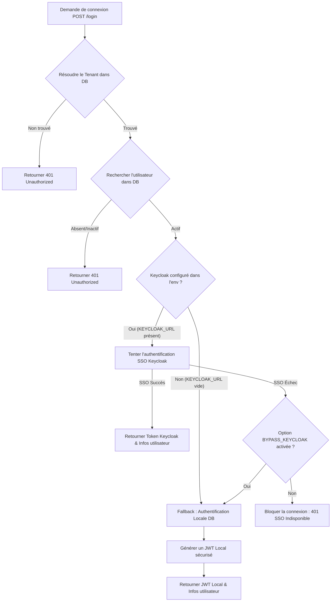

# ⚙️ Architecture Backend — Authentification (Auth)

Ce document décrit l'implémentation, l'architecture et le fonctionnement du module d'authentification (Auth) côté **Backend (NestJS + TypeScript)**.

---

## 1. ⚙️ Stack & Modules Backend
L'authentification backend repose sur les modules et concepts NestJS suivants :
- **`AuthModule`** : Module centralisé déclarant les contrôleurs, services, stratégies Passeport, et l'enregistrement du service JWT.
- **`PassportModule` & `@nestjs/jwt`** : Gestion standardisée des jetons de sécurité JWT.
- **`TypeOrmModule`** : Accès aux entités de la base de données (`User`, `Tenant`, `Employee`).
- **`ConfigModule`** : Récupération des variables d'environnement (`KEYCLOAK_URL`, `JWT_SECRET`, `BYPASS_KEYCLOAK`, etc.).

---

## 2. 🛡️ SSO Keycloak & Système de Fallback Local
Le backend intègre une architecture double pour s'adapter à la fois aux déploiements d'entreprise complexes et aux environnements de développement simplifiés :



### ⚙️ Variables d'Environnement Clés :
- `KEYCLOAK_URL` : URL de base du serveur Keycloak (ex: `https://sso.monentreprise.com`). Si vide, le serveur bascule automatiquement sur le mode JWT Local.
- `BYPASS_KEYCLOAK` : Si mis à `true`, autorise le repli sur le JWT local en production même si l'URL Keycloak est définie mais inaccessible.
- `JWT_SECRET` : Clé secrète robuste utilisée pour signer et valider les jetons JWT locaux générés par le backend.
- `JWT_EXPIRES_IN` : Durée de validité des jetons d'accès locaux (ex: `24h`).

---

## 3. 👤 Protection des Endpoints (`JwtAuthGuard`)
Pour sécuriser un contrôleur ou une méthode, NestJS utilise des Guards combinés avec des décorateurs personnalisés :

```typescript
import { UseGuards, Controller, Get } from '@nestjs/common';
import { JwtAuthGuard } from './guards/jwt-auth.guard';
import { RolesGuard } from './guards/roles.guard';
import { Roles } from './decorators/roles.decorator';

@Controller('employees')
@UseGuards(JwtAuthGuard, RolesGuard) // Applique la sécurité JWT + Rôles
export class EmployeesController {
  @Get()
  @Roles('HR_ADMIN', 'CEO') // Limite l'accès à ces rôles
  findAll() {
    return this.employeesService.findAll();
  }
}
```

---

## 4. 🏢 Isolation Multi-Tenant (`TenantMiddleware`)
L'authentification est intimement liée au cloisonnement des données (Multi-tenancy). 
Chaque requête entrante après authentification passe par un intercepteur/middleware :
1. Extraction du header `x-tenant-id`.
2. Validation que l'UUID correspond à un tenant actif.
3. Injection du `tenantId` dans le contexte de requête (`req.tenantId`).
4. Toutes les requêtes SQL automatiques via TypeORM filtrent sur cette valeur pour empêcher les fuites de données inter-entreprises.
