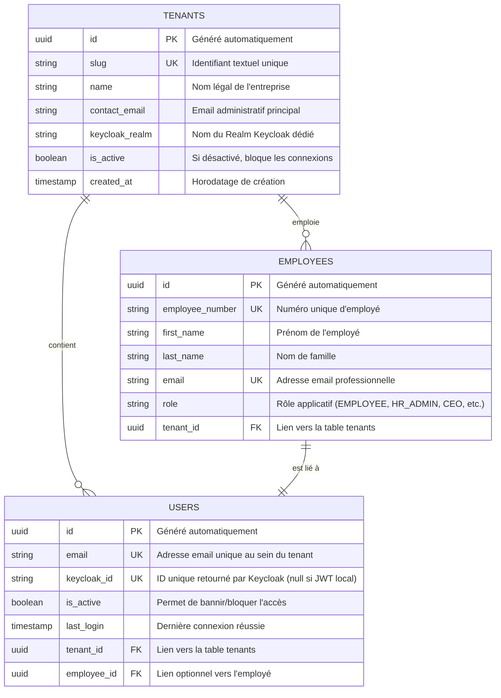

# 🗄️ Schéma de Base de Données — Authentification (Auth)

Ce document décrit l'organisation et la structure des données liées à l'authentification dans la base de données PostgreSQL, à l'aide de l'ORM **TypeORM**.

---

## 1. 📊 Modèle Conceptuel (MCD)

Le schéma ci-dessous montre la structure des tables principales qui gèrent l'authentification et les relations de multi-tenancy :

---

## 2. 📝 Description des Tables PostgreSQL

### 🏢 Table `tenants`
Stocke les entreprises abonnées ou configurées sur l'application.

| Colonne | Type SQL | Contraintes | Description |
|---|---|---|---|
| `id` | `uuid` | `PRIMARY KEY, DEFAULT uuid_generate_v4()` | UUID unique. |
| `slug` | `varchar` | `UNIQUE, NOT NULL` | Code entreprise (ex: `quebec-inc`). |
| `name` | `varchar` | `NOT NULL` | Nom affiché. |
| `keycloak_realm` | `varchar` | `NULL` | Realm d'authentification dédié. |
| `is_active` | `boolean` | `DEFAULT true` | Blocage global de l'accès à l'entreprise. |

---

### 👤 Table `users`
Contient les identifiants et les liaisons d'accès.

| Colonne | Type SQL | Contraintes | Description |
|---|---|---|---|
| `id` | `uuid` | `PRIMARY KEY, DEFAULT uuid_generate_v4()` | UUID unique de l'utilisateur. |
| `email` | `varchar` | `UNIQUE, NOT NULL` | Email d'authentification principal. |
| `keycloak_id` | `varchar` | `UNIQUE, NULL` | Clé externe SSO de Keycloak. |
| `is_active` | `boolean` | `DEFAULT true` | Statut d'activation du compte. |
| `tenant_id` | `uuid` | `FOREIGN KEY (tenants.id), NOT NULL` | Scoping du locataire (multi-tenant). |
| `employee_id` | `uuid` | `FOREIGN KEY (employees.id), NULL` | Liaison vers la fiche employé du SIRH. |

---

## 3. ⚡ Index et Performance
Pour optimiser les performances lors de la connexion (qui survient à chaque requête HTTP via le Guard) :
- **Index Unique Composé** : `UNIQUE INDEX idx_user_email_tenant` sur `(email, tenant_id)`. Cela garantit qu'un utilisateur possède un compte unique au sein de chaque entreprise, tout en autorisant le même email sur des entreprises différentes.
- **Index de Clé Étrangère** : Index standard sur `tenant_id` pour accélérer les opérations d'isolation des requêtes.
