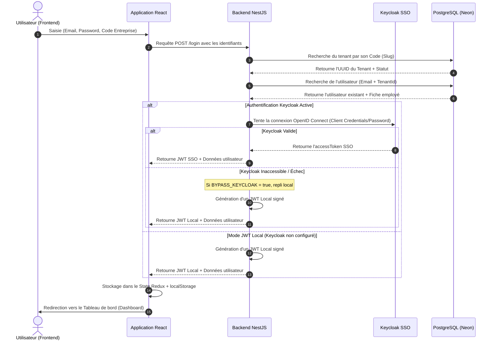

# 🔄 Workflows & Processus — Authentification (Auth)

Ce document décrit en détail les processus séquentiels d'authentification, de la saisie par l'utilisateur final jusqu'au maintien de la session sécurisée.

---

## 1. 🔑 Workflow de Connexion Principal (Sign-In)

Voici la séquence complète d'actions effectuées lors de la connexion :

---

## 2. ⏳ Gestion de l'Expiration de Session (Refresh Token)

Afin d'offrir une expérience utilisateur fluide tout en garantissant la sécurité :
1. **Durée de vie des Tokens** :
   - Les tokens de session ont une durée par défaut de **24 heures** (JWT local) ou selon le paramétrage Keycloak.
2. **Détection d'Expiration** :
   - À chaque appel API, l'intercepteur Axios écoute les réponses.
   - Si le backend renvoie un statut **`401 Unauthorized`** avec un code indiquant un token expiré :
     - Le frontend intercepte la réponse.
     - L'utilisateur est automatiquement déconnecté pour éviter les états incohérents.
     - Une notification Toast s'affiche : *"Votre session a expiré, veuillez vous reconnecter"*.
     - Redirection immédiate vers `/login`.

---

## 3. 🛡️ Résolution Automatique du Code Entreprise (Subdomain / Slug)

Pour simplifier la vie des utilisateurs, le système prend en charge deux méthodes de connexion :
- **Entrée manuelle** : L'utilisateur saisit le code entreprise dans le formulaire (ex: `quebec-inc`).
- **Résolution par URL** (Optionnel en production) : 
  - Si l'utilisateur accède au portail via `https://quebec-inc.sirh.net`, le frontend extrait le sous-domaine `quebec-inc` et le pré-remplit dans le formulaire de connexion de manière totalement invisible.
