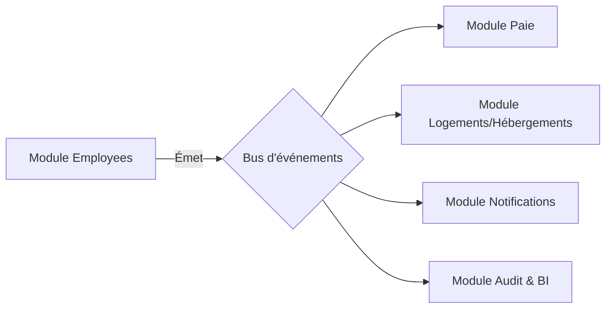

# 📢 Système d'Événements — Gestion des Employés (Employees)

Ce document décrit le modèle événementiel du module Employees et détaille comment les autres modules du SIRH réagissent aux changements d'état des collaborateurs.

---

## 1. ⚡ Liste des Événements Applicatifs Émis

Chaque fois qu'une action majeure survient sur une fiche employé, un événement système est publié via le bus d'événements du backend (NestJS `EventEmitter` ou un système de files comme Redis/RabbitMQ) :

### 🆕 `EMPLOYEE_CREATED`
Émis immédiatement après l'enregistrement réussi d'une nouvelle recrue.
- **Payload** : `id`, `tenantId`, `firstName`, `lastName`, `email`, `hireDate`, `departmentId`, `positionId`.

### 🔄 `EMPLOYEE_UPDATED`
Émis lors de toute modification d'information sur un profil (changement d'adresse, de poste, de salaire).
- **Payload** : `id`, `tenantId`, `changes` (clé/valeur des modifications apportées).

### 🚪 `EMPLOYEE_TERMINATED`
Émis lorsqu'un contrat prend fin (démission, fin de CDD, licenciement) et que le statut passe à `TERMINATED`.
- **Payload** : `id`, `tenantId`, `terminationDate`, `reason`.

### 🗄️ `EMPLOYEE_ARCHIVED`
Émis lors de l'archivage final du dossier (Soft Delete).
- **Payload** : `id`, `tenantId`, `deletedAt`.

---

## 2. 👥 Consommateurs & Actions Associées

Les autres modules du SIRH écoutent ces événements pour automatiser les flux de travail :

### 💰 Module Paie (Payroll)
- **Écoute** : `EMPLOYEE_CREATED` et `EMPLOYEE_UPDATED` (changements de salaire) et `EMPLOYEE_TERMINATED`.
- **Actions** :
  - Ouvre automatiquement le dossier de rémunération lors d'une embauche.
  - Ajuste le calcul de la paie en cours lors d'un changement de salaire horaire ou annuel.
  - Déclenche la génération du **solde de tout compte** et des attestations de fin d'emploi lors d'un `EMPLOYEE_TERMINATED`.

### 🏠 Module Hébergement (Housing)
- **Écoute** : `EMPLOYEE_TERMINATED` et `EMPLOYEE_ARCHIVED`.
- **Actions** :
  - Planifie automatiquement la libération du logement occupé par l'employé et génère une alerte logistique pour l'état des lieux.

### 🔔 Module Notifications
- **Écoute** : Tous les événements.
- **Actions** :
  - Envoie un e-mail de bienvenue au collaborateur lors de sa création.
  - Alerte l'administrateur en cas de modification suspecte sur des données bancaires ou salariales.

### 📊 Module Audit & BI
- **Écoute** : Tous les événements.
- **Actions** :
  - Écrit une ligne non modifiable dans le registre d'audit de sécurité globale pour la conformité.
