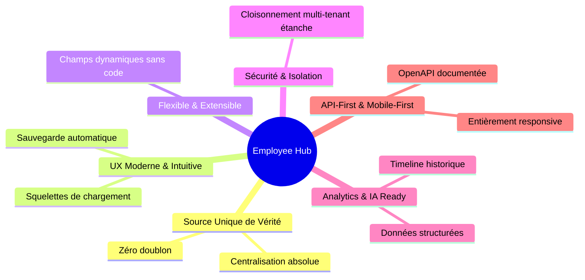

# 📉 Problèmes Marché & Objectifs — Gestion des Employés (Employees)

Ce document identifie les faiblesses critiques des systèmes d'information RH (SIRH) concurrents concernant la gestion des employés et définit les objectifs clés de notre solution pour y remédier.

---

## 1. 🔍 Problèmes des SIRH Existants

Les solutions logicielles actuelles (notamment les ERP monolithiques) souffrent de plusieurs défauts majeurs qui pèsent sur l'efficacité des équipes RH :

| Problème | Description technique | Conséquence opérationnelle |
|---|---|---|
| **1. Données dispersées** | Les informations des employés sont dupliquées et stockées dans plusieurs bases ou modules disjoints (paie, absences, recrutement). | ❌ Incohérences flagrantes, erreurs répétées sur la paie, saisies manuelles doublées et mauvaise qualité globale des données. |
| **2. UX complexe** | Interfaces utilisateur vieillissantes datant des années 2000 avec des formulaires surchargés (plus de 50 champs affichés d'un coup). | ❌ Très faible adoption par les collaborateurs, erreurs massives lors de la saisie, charge cognitive élevée pour les équipes RH. |
| **3. Personnalisation difficile** | L'ajout d'un simple champ spécifique (ex: pointure de chaussures de sécurité, certification) nécessite des développements SQL/Code lourds. | ❌ Coûts de maintenance astronomiques et rigidité extrême face aux évolutions de l'entreprise. |
| **4. Mauvaise gestion multi-tenant** | L'isolation des données entre les différentes entreprises clientes d'un même SaaS est gérée au niveau applicatif léger et non en base. | ❌ Risques élevés de fuites de données inter-entreprises et vulnérabilités de sécurité critiques. |
| **5. Reporting compliqué** | Extraction des données et exportations complexes nécessitant l'intervention de consultants techniques ou d'équipes BI dédiées. | ❌ Dépendance totale envers des tiers et incapacité pour les gestionnaires RH de prendre des décisions rapides. |

---

## 2. 🎯 Objectif Produit : L'Employee Hub Moderne

Notre but est de concevoir un **Employee Hub** de classe mondiale qui redéfinit les standards du marché :

- **Source unique de vérité** : Centralisation complète de la donnée collaborateur.
- **Expérience Utilisateur (UX) Exceptionnelle** : Interfaces fluides, épurées et intuitives.
- **Extensible & Configurable** : Permettre aux administrateurs de moduler l'outil sans expertise technique.
- **Analytics & IA-Ready** : Préparer la structure des données pour l'extraction de métriques décisionnelles intelligentes.
- **Mobile-First & API-First** : Permettre aux employés d'accéder à leur espace depuis n'importe quel smartphone de manière sécurisée.
