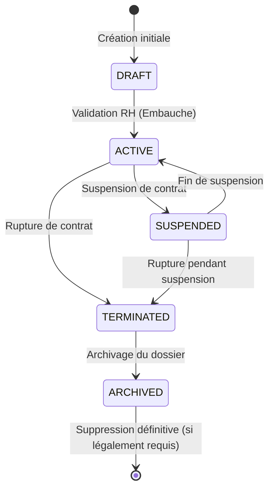

# 🤖 Machine à États — Gestion des Employés (Employees)

Ce document décrit la machine à états finis (Finite State Machine) régissant le statut des fiches d'employés et liste les transitions autorisées et interdites.

---

## 1. 📊 Modèle de la Machine à États

Le diagramme suivant montre comment le statut d'une fiche employé peut transiter d'un état à un autre :

---

## 2. 🚦 Tableau des Transitions d'États

Le tableau ci-dessous liste la validité des transitions entre tous les états :

| État Initial ➔ Cible | `DRAFT` | `ACTIVE` | `SUSPENDED` | `TERMINATED` | `ARCHIVED` |
|---|---|---|---|---|---|
| **`DRAFT`** | — | ✅ Oui | ❌ Non | ❌ Non | ❌ Non |
| **`ACTIVE`** | ❌ Non | — | ✅ Oui | ✅ Oui | ❌ Non |
| **`SUSPENDED`** | ❌ Non | ✅ Oui | — | ✅ Oui | ❌ Non |
| **`TERMINATED`** | ❌ Non | ❌ Non | ❌ Non | — | ✅ Oui |
| **`ARCHIVED`** | ❌ Non | ❌ Non | ❌ Non | ❌ Non | — |

---

## 🔒 Règles de Transition Strictes & Interdites (Forbidden Transitions)

Pour préserver l'intégrité de la base de données et empêcher les erreurs de manipulation RH critiques, les règles suivantes sont codées au niveau du service :

> [!CAUTION]
> **Règle 1 — Pas de retour à la case départ (ARCHIVED ➔ ACTIVE)**
> Une fois qu'un dossier employé est archivé (`ARCHIVED`), il ne peut jamais repasser directement au statut actif (`ACTIVE`). Si le collaborateur est réembauché, il est obligatoire de créer une nouvelle fiche avec un nouveau matricule et de nouveaux contrats pour conserver un historique propre.

> [!WARNING]
> **Règle 2 — Pas de résurrection de contrat rompu (TERMINATED ➔ DRAFT)**
> Un employé licencié ou démissionnaire (`TERMINATED`) ne peut pas repasser en mode brouillon (`DRAFT`). L'état brouillon est réservé exclusivement aux nouvelles recrues en cours de saisie initiale.

> [!IMPORTANT]
> **Règle 3 — Pas d'archivage à chaud (ACTIVE ➔ ARCHIVED)**
> Il est interdit d'archiver directement un employé actif (`ACTIVE`). Il doit impérativement passer par l'état intermédiaire de fin de contrat (`TERMINATED`) pour garantir que toutes les procédures de départ légales et de versement de solde de tout compte ont été complétées.
