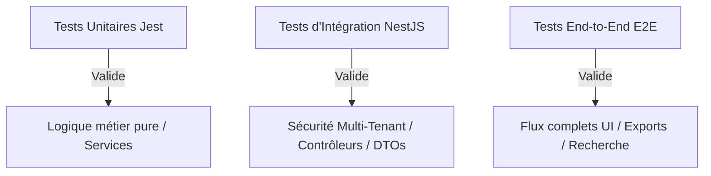

# 🧪 Stratégie de Tests — Gestion des Employés (Employees)

Ce document présente l'approche et les cas d'utilisation pour valider la stabilité, la sécurité et la conformité légale du module Employees.

---

## 1. ⚙️ Niveaux de Tests & Outils

La robustesse du code de gestion des effectifs repose sur trois piliers de test automatisés :

---

## 2. 📝 Scénarios de Tests Unitaires (Unit Tests)

Les tests unitaires se concentrent sur `employee.service.spec.ts` et isolent les cas critiques :

### 🟢 Scénarios de succès :
1.  **Création propre d'un employé** :
    - Saisie d'une fiche conforme.
    - *Résultat attendu* : L'employé est enregistré en base de données, un numéro de matricule valide (ex: `EMP-2026-X`) lui est assigné automatiquement, et l'événement `EMPLOYEE_CREATED` est émis.
2.  **Archivage réussi (Soft Delete)** :
    - Appel à la méthode `archive` sur un employé valide.
    - *Résultat attendu* : Le statut de l'employé passe à `ARCHIVED`, la colonne `deleted_at` contient la date actuelle, la fiche n'apparaît plus dans les requêtes de recherche courantes, et l'événement `EMPLOYEE_ARCHIVED` est émis.

### 🔴 Scénarios d'échec :
1.  **Doublon d'adresse email au sein du même Tenant** :
    - Tentative de création avec un email déjà existant dans le même locataire.
    - *Résultat attendu* : L'enregistrement échoue et lève une exception `ConflictException` (Code HTTP `409`).
2.  **Règle de transition interdite (State Machine)** :
    - Tentative de passer directement une fiche du statut `ARCHIVED` au statut `ACTIVE`.
    - *Résultat attendu* : Lève une exception `BadRequestException` empêchant l'écriture SQL.

---

## 3. 🛡️ Scénarios de Tests d'Intégration (Integration Tests)

Ils simulent des requêtes HTTP complètes sur le serveur NestJS en validant les couches de sécurité :

-   **Test d'isolation Multi-Tenant** :
    - Un utilisateur authentifié sur le Tenant A tente de lire (`GET /employees/:id`) ou de modifier (`PATCH`) une fiche employé appartenant au Tenant B.
    - *Résultat attendu* : L'appel est rejeté immédiatement avec un statut **`403 Forbidden`** (ou `404 Not Found` pour ne pas divulguer l'existence de la fiche).
-   **Validation des permissions RBAC** :
    - Un utilisateur avec le rôle `EMPLOYEE` tente d'accéder à l'endpoint de création (`POST /employees`) ou de lecture salariale (`employee.salary.read`).
    - *Résultat attendu* : Rejet avec un statut **`403 Forbidden`**.

---

## 4. 🖥️ Scénarios de Tests End-to-End (E2E Tests)

Simulations d'actions utilisateurs réelles sur le navigateur (Playwright) :
1.  **Flux d'embauche complet** :
    - Se connecter en tant que `HR_ADMIN` ➔ Aller sur `/employees` ➔ Cliquer sur "Ajouter un employé" ➔ Remplir le formulaire en 3 étapes (Divulgation progressive) ➔ Enregistrer ➔ Vérifier que la nouvelle fiche apparaît dans le tableau avec le statut `ACTIVE`.
2.  **Performance de la table virtualisée** :
    - Charger la page avec 5 000 enregistrements factices injectés ➔ Faire défiler rapidement la page (scroll) ➔ Vérifier que l'interface reste fluide et que le défilement ne subit aucun ralentissement.
3.  **Flux d'export de données** :
    - Filtrer les employés actifs du département "R&D" ➔ Cliquer sur "Exporter CSV" ➔ Vérifier que le fichier généré contient exactement les colonnes et les lignes filtrées.
