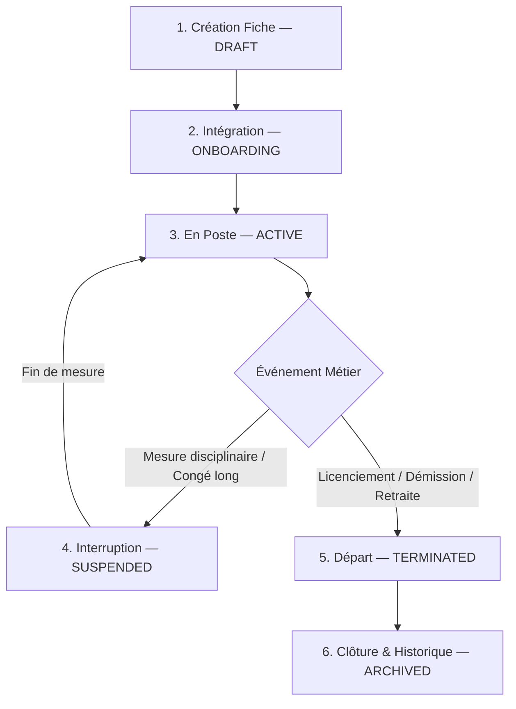

# 🔄 Workflows du Collaborateur — Gestion des Employés (Employees)

Ce document décrit le cycle de vie complet d'un collaborateur au sein de l'organisation, depuis son entrée initiale dans le système jusqu'à son archivage historique.

---

## 1. 🗺️ Le Cycle de Vie Global du Collaborateur

Le parcours d'un employé au sein du SIRH est régi par une succession d'étapes ordonnées :

---

## 2. 📝 Description Détaillée des Étapes

### 1️⃣ Création de la fiche (`DRAFT`)
- **Action** : Le gestionnaire RH crée un profil d'embauche préliminaire.
- **Règle** : Seuls les champs d'identification de base (nom, prénom, email, poste) sont nécessaires à cette étape. Les données de paie ou bancaires ne sont pas encore requises.

### 2️⃣ Phase d'intégration (`ONBOARDING`)
- **Action** : Le futur employé reçoit ses accès, complète son profil (coordonnées d'urgence, RIB), fournit ses pièces justificatives (carte d'identité, permis).
- **Workflow associé** : Génération automatique des tâches d'intégration (attribution d'ordinateur, signature du contrat, visite médicale).

### 3️⃣ Actif en poste (`ACTIVE`)
- **Action** : Le collaborateur est pleinement opérationnel.
- **Droits** : Il apparaît dans les plannings d'horaires, accumule des droits à congés, reçoit ses bulletins de salaire mensuels et peut utiliser son accès employé standard.

### 4️⃣ Suspension temporaire (`SUSPENDED`)
- **Action** : Le contrat ou l'activité est temporairement gelé (mise à pied, congé sabbatique long, congé parental long).
- **Impact** : L'accès au SIRH est suspendu ou restreint. L'accumulation des droits de congés et le versement des salaires sont mis en pause selon le motif juridique.

### 5️⃣ Fin de contrat (`TERMINATED`)
- **Action** : Rupture de contrat actée (démission, fin de CDD, licenciement, départ à la retraite).
- **Workflow associé** : Calcul automatique du solde de tout compte par le module **Paie**, révocation des accès système à la date de départ effective, restitution du matériel.

### 6️⃣ Archivage historique (`ARCHIVED`)
- **Action** : La fiche est basculée dans les archives de l'entreprise.
- **Impact** : L'employé n'apparaît plus dans l'annuaire actif mais son dossier historique (contrats, fiches de paie antérieures) reste consultable par les RH autorisés pour des raisons légales et d'obligations d'archivage d'entreprise.
