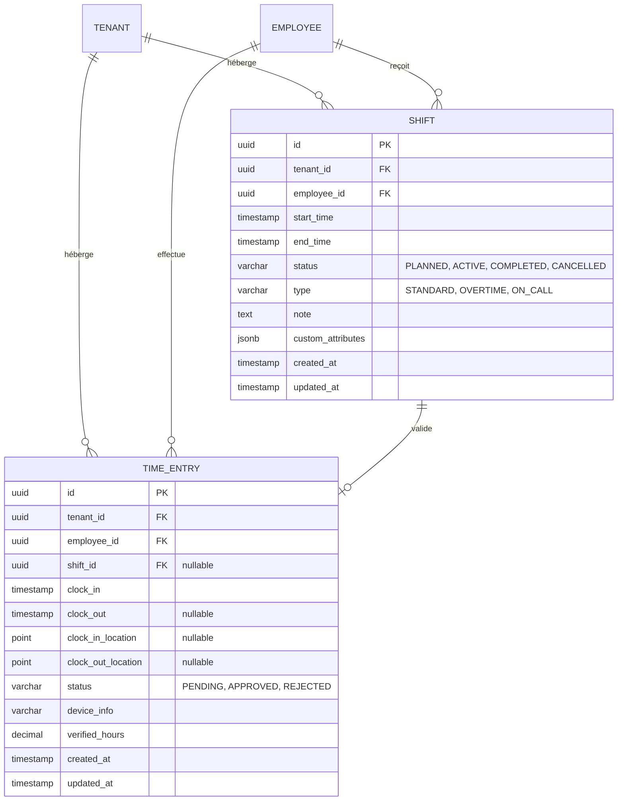

# 🗄️ Spécifications de la Base de Données — Gestion des Horaires & Présences (Shifts)

Ce document définit le modèle de données, les contraintes d'intégrité, les indexations et le plan de migration pour le module Shifts sous PostgreSQL.

---

## 1. 🗺️ Modèle Logique des Données (MLD)

Le module repose sur deux entités clés :
1.  `Shift` : Représente la planification (les heures planifiées pour un employé).
2.  `TimeEntry` : Représente la réalité (les événements réels de pointage d'entrée et de sortie).



---

## 2. 📝 Structure des Tables & Entités TypeORM

### Entité `Shift`
*   **Table PostgreSQL** : `shifts`
*   **Contrainte d'isolation multi-tenant** : `tenant_id` obligatoire.
*   **Règle d'indexation** : Index composé unique pour éviter la surplanification d'un employé sur des plages horaires qui se chevauchent.

```typescript
@Entity('shifts')
@Index(['tenantId', 'employeeId'])
@Index(['tenantId', 'startTime', 'endTime'])
export class Shift {
  @PrimaryGeneratedColumn('uuid')
  id: string;

  @Column({ name: 'tenant_id', type: 'uuid' })
  tenantId: string;

  @Column({ name: 'employee_id', type: 'uuid' })
  employeeId: string;

  @Column({ name: 'start_time', type: 'timestamptz' })
  startTime: Date;

  @Column({ name: 'end_time', type: 'timestamptz' })
  endTime: Date;

  @Column({
    type: 'enum',
    enum: ShiftStatus,
    default: ShiftStatus.PLANNED,
  })
  status: ShiftStatus;

  @Column({
    type: 'enum',
    enum: ShiftType,
    default: ShiftType.STANDARD,
  })
  type: ShiftType;

  @Column({ type: 'text', nullable: true })
  note?: string;

  @Column({ name: 'custom_attributes', type: 'jsonb', nullable: true })
  customAttributes?: Record<string, any>;

  @CreateDateColumn({ name: 'created_at' })
  createdAt: Date;

  @UpdateDateColumn({ name: 'updated_at' })
  updatedAt: Date;
}
```

---

## 3. ⚡ Indexations & Optimisations de Requêtes

Pour soutenir une interface Drag & Drop performante avec un chargement de grilles ultra-fluide, nous mettons en place des indexations stratégiques au niveau PostgreSQL :

1.  **Index de Filtrage Planning** :
    ```sql
    CREATE INDEX idx_shifts_lookup 
    ON shifts (tenant_id, employee_id, start_time, end_time);
    ```
    *Pourquoi ?* Accélère considérablement le chargement de la grille d'horaire pour une semaine donnée pour tous les employés d'un locataire (tenant).

2.  **Index Géospatial (Pointage)** :
    ```sql
    CREATE INDEX idx_time_entries_geo 
    ON time_entries USING gist (clock_in_location);
    ```
    *Pourquoi ?* Permet de faire des calculs rapides de proximité géographique (géofencing) lors de l'action de pointage.

3.  **Contrainte de Non-Chevauchement** :
    Nous implémentons une contrainte d'exclusion pour empêcher qu'un même employé ne soit planifié sur deux quarts de travail superposés au sein du même tenant :
    ```sql
    ALTER TABLE shifts 
    ADD CONSTRAINT exclude_overlapping_shifts 
    EXCLUDE USING gist (
      employee_id WITH =,
      tenant_id WITH =,
      tsrange(start_time, end_time) WITH &&
    );
    ```
