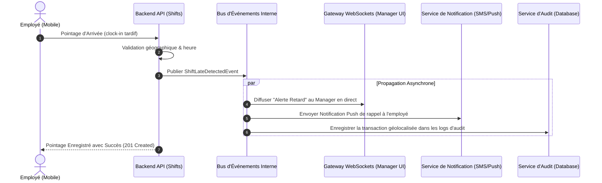

# 📣 Architecture des Événements du Domaine — Gestion des Horaires & Présences (Shifts)

Ce document répertorie et décrit les événements du domaine émis par le module Shifts pour assurer une communication asynchrone et découplée avec les autres modules (Notifications, Paie, Audit).

---

## 1. 📋 Catalogue des Événements du Domaine

Chaque événement émis encapsule le `tenantId` pour garantir la sécurité et l'isolation des traitements en arrière-plan.

| Nom de l'Événement | Canal de propagation | Déclencheur Opérationnel | Auditeurs (Consumers) |
| :--- | :--- | :--- | :--- |
| **`ShiftCreatedEvent`** | Event-Emitter / Kafka | Planification d'un nouveau quart par le manager. | `NotificationsModule` (Envoi de SMS/Push à l'employé). |
| **`ClockedInEvent`** | WebSockets (Socket.io) | Pointage d'arrivée réussi par un employé. | `RealTimeGateway` (Mise à jour du tableau de bord manager en temps réel). |
| **`ClockedOutEvent`** | Event-Emitter / Paie | Pointage de départ réussi par un employé. | `PayrollModule` (Cumul des heures travaillées pour la paie), `AuditModule` (Log de sécurité). |
| **`ShiftLateDetectedEvent`**| WebSockets & Email | Absence de pointage d'arrivée 5 minutes après l'heure théorique. | `NotificationsModule` (Alerte instantanée par WebSocket au manager), `SlackWebhookConnector`. |
| **`OvertimeReachedEvent`** | Event-Emitter | Le cumul hebdomadaire d'un employé dépasse le seuil des 40 heures. | `PayrollModule` (Enregistrement de la majoration), `ManagerAlertService` (Alerte de coût supplémentaire). |

---

## 2. 🔄 Diagramme de Séquence des Intégrations Événementielles

Ce schéma illustre la communication découplée lors du pointage d'arrivée d'un employé en retard.



---

## 3. 📝 Payload des Événements (Exemples)

### Payload de `ShiftLateDetectedEvent`
```json
{
  "eventId": "f7d79b9b-cb78-4ea0-bf21-995cdb5059d1",
  "eventType": "ShiftLateDetectedEvent",
  "timestamp": "2026-05-24T08:06:00Z",
  "tenantId": "d3b07384-d113-4a11-9e2e-2f3b8908cf44",
  "data": {
    "shiftId": "7a26fde3-ee99-4d66-a621-0fb4a9463941",
    "employeeId": "e309f4b5-82dd-4ca7-9c98-1e428254c46f",
    "employeeName": "Jean Tremblay",
    "scheduledStartTime": "2026-05-24T08:00:00Z",
    "minutesLate": 6
  }
}
```
*Intérêt* : Permet au module de notification de composer un message ciblé sans réinterroger la base de données principale des employés.
