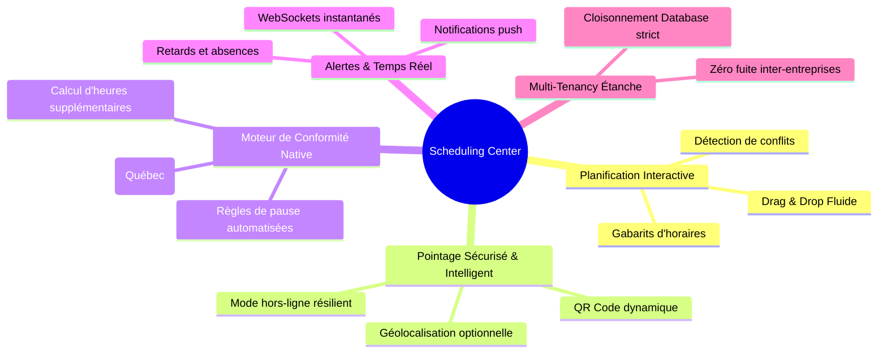

# 📉 Problèmes Marché & Objectifs — Gestion des Horaires & Présences (Shifts)

Ce document identifie les faiblesses critiques des systèmes d'information RH (SIRH) concurrents concernant la planification des horaires, le pointage et la gestion des temps, et définit les objectifs clés de notre solution pour y remédier.

---

## 1. 🔍 Problèmes des SIRH Existants sur le Marché

Les solutions logicielles actuelles (monolithes ERP ou outils de pointage dédiés) souffrent de limitations majeures qui pèsent sur la productivité des gestionnaires et l'expérience des employés :

| Faiblesse Concurrentielle | Description Technique | Conséquence Opérationnelle |
| :--- | :--- | :--- |
| **1. Planification rigide et non réactive** | Grilles horaires statiques en tableau html classique, sans support natif du Drag & Drop ou de la mise à jour en temps réel. | ❌ Perte de temps colossale pour les managers (plusieurs heures par semaine), conflits d'horaires fréquents et frustration des équipes. |
| **2. Fraude au pointage (*Buddy Punching*)** | Pointage basé sur de simples boutons sans vérification de localisation (GPS) ni validation contextuelle sécurisée (ex: QR code). | ❌ Vol de temps de travail, inexactitude flagrante des heures payées et surcoûts financiers importants pour l'entreprise. |
| **3. Non-conformité légale (Normes QC)** | Absence de calcul automatique des heures supplémentaires (seuil de 40h/semaine) et des temps de pause obligatoires. | ❌ Risques élevés de litiges aux Normes du Travail, amendes administratives et calcul manuel laborieux lors de la paie. |
| **4. Manque d'intégration temps réel** | Les événements de pointage (entrées/sorties) ne se répercutent pas instantanément sur le tableau de bord du manager. | ❌ Incapacité à réagir rapidement en cas d'absence imprévue ou de retard critique sur un quart de travail stratégique. |
| **5. Cloisonnement Multi-Tenant poreux** | Données d'horaires et de pointage isolées par simple filtre SQL léger, sans contrainte stricte au niveau de la base de données. | ❌ Risques majeurs de fuites de plannings ou d'informations de présence confidentielles entre entreprises concurrentes. |

---

## 2. 🎯 Objectif Produit : Le Scheduling Center Moderne

Notre but est de concevoir un module **Shifts & Attendance** de classe mondiale qui redéfinit les standards de l'industrie :

*   **Planification Interactive & Collaborative** : Une interface visuelle d'horaire hebdomadaire et mensuelle entièrement gérée en Drag & Drop avec validation automatique des conflits de disponibilité.
*   **Pointage Mobile de Confiance** : Un système de pointage résilient et sécurisé avec géolocalisation ou par QR code dynamique pour éliminer la fraude tout en respectant la vie privée.
*   **Moteur de Règles Légales Canadien/Québécois** : Automatisation complète du calcul des heures supplémentaires (majorées à 1.5x après 40h/semaine) et vérification des temps de repos réglementaires.
*   **Réactivité en Temps Réel** : Communication instantanée via WebSockets pour alerter les gestionnaires en cas de retard critique, de non-pointage ou d'absence.
*   **Isolation Multi-Tenant Totale** : Sécurité absolue avec application systématique du `tenantId` à chaque transaction, indexation optimisée et intégrité référentielle en base PostgreSQL Neon.
