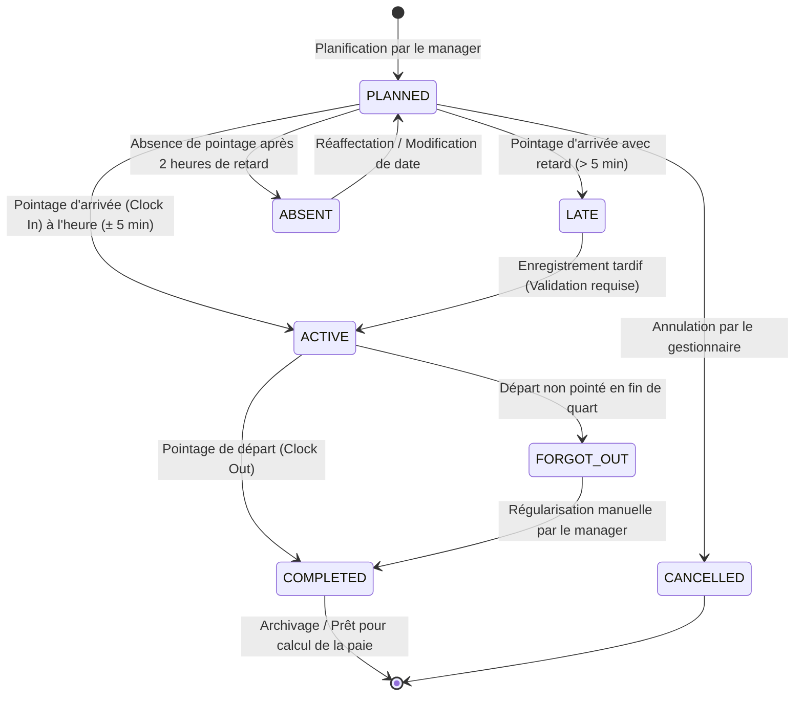

# 🔄 Machine à États Finis — Gestion des Horaires & Présences (Shifts)

Ce document modélise le cycle de vie d'un quart de travail (Shift) planifié et son exécution opérationnelle via la machine à états de l'application.

---

## 1. 🗺️ Diagramme d'État Mermaid

Le cycle de vie du quart de travail commence à sa planification par le gestionnaire et se termine après l'exécution ou l'annulation du shift.

---

## 2. 📝 Description des États du Système

*   **`PLANNED` (Planifié)** : Le quart de travail est affecté à un employé et inséré dans le calendrier. L'employé reçoit une notification sur son mobile. Il est en attente du pointage de début.
*   **`ACTIVE` (Actif / En cours)** : L'employé a effectué son pointage d'arrivée (Clock In) valide. Le compteur de temps tourne. Le manager voit l'employé présent sur son tableau de bord en temps réel.
*   **`LATE` (En retard)** : L'employé ne s'est pas présenté à l'heure planifiée (plus de 5 minutes après le début théorique). Le système bascule automatiquement dans cet état, notifie le manager et attend le pointage tardif.
*   **`ABSENT` (Absent)** : Si aucun pointage n'est enregistré 2 heures après le début théorique du shift, l'état bascule à `ABSENT`. Cet état génère une alerte d'absence injustifiée.
*   **`FORGOT_OUT` (Oubli de sortie)** : L'employé a pointé à l'arrivée mais n'a pas pointé à son départ alors que l'heure théorique de fin de shift est dépassée de plus de 4 heures. Le système marque la fiche pour correction manuelle.
*   **`COMPLETED` (Complété)** : Le shift s'est déroulé, le pointage d'arrivée et de départ sont validés. Les heures réelles sont enregistrées pour la paie.
*   **`CANCELLED` (Annulé)** : Le shift a été supprimé ou annulé avant son exécution.

---

## 3. 🛡️ Règles de Transition Stricte & Sécurisée

1.  **Transition `PLANNED` ➔ `ACTIVE`** :
    *   *Condition* : Nécessite que l'employé soit authentifié sur le même `tenantId`, que sa géolocalisation soit validée (dans la zone de confiance du lieu de travail) et que l'heure actuelle soit dans la fenêtre d'exécution.
2.  **Transition `LATE` ➔ `ACTIVE`** :
    *   *Condition* : L'employé peut pointer en retard. La transition enregistre le retard et le soumet à une approbation obligatoire du manager pour justifier le motif de l'arrivée tardive.
3.  **Régularisation de `FORGOT_OUT`** :
    *   *Condition* : Seul un administrateur (`ADMIN`), RH (`HR`) ou gestionnaire (`MANAGER`) peut modifier un shift au statut `FORGOT_OUT` pour saisir manuellement l'heure réelle de départ sur la base de justificatifs.
