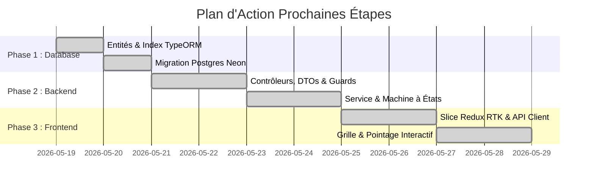

# 🧭 Journal de Bord & Suivi de Développement (Development Tracker)

Ce document est le **compas officiel de développement** du SIRH. Il recense l'historique complet des réalisations, l'état actuel de l'infrastructure locale/cloud, les décisions d'architecture prises, et sert de guide de démarrage obligatoire avant d'entamer toute modification pour garantir une traçabilité totale et éviter toute perte de temps.

---

## ⚠️ Règles d'Ingénierie à Respecter en Tout Temps

1.  **Strict Cloisonnement Multi-Tenant** : Aucun accès SQL, traitement API ou affichage UI ne doit contourner la vérification obligatoire de l'identifiant du locataire (`tenantId` / `x-tenant-id`).
2.  **Modularité Lâche (Decoupled Architecture)** : Les fonctionnalités métier (Auth, Employees, Housing) sont développées comme des modules isolés sans dépendance circulaire.
3.  **Ergonomie Premium (WCAG & Catppuccin)** : Utiliser systématiquement les variables CSS du thème Catppuccin (Mocha/Latte) avec une transition fluide de 250ms, des squelettes de chargement pulsation, et une accessibilité clavier complète.
4.  **Consulter ce Journal de Bord** : Avant de coder, toujours lire ce document pour valider où nous en sommes rendus.

---

## 📈 État Global du Projet

- **Frontend** : 🟢 Opérationnel (React + Redux Toolkit + Vite + i18n & Mode Sombre natifs).
- **Backend** : 🟢 Opérationnel (NestJS + TypeORM + Keycloak Bypass/Fallback local).
- **Base de Données** : 🟢 Opérationnel (PostgreSQL Serverless Neon Cloud).
- **Déploiement Cloud** : 🟢 Configuré (Vercel pour le frontend, Render pour le backend).

---

## ✅ Historique des Réalisations (Chronique)

### 1. 🌐 Système d'Internationalisation (i18n) & Thèmes
- [x] **Moteur i18n Léger Natif** (`src/i18n/`) : Résolution de clés imbriquées (ex: `t('nav.dashboard')`), remplacement de paramètres dynamiques, fallback automatique en français (FR).
- [x] **Fichiers de Traduction JSON** : Prise en charge complète du **Français 🇫🇷**, **Anglais 🇬🇧**, et **Espagnol 🇪🇸** dans `frontend/src/i18n/locales/*.json`.
- [x] **Contexte Global React** (`AppContext.tsx`) : Exposition globale de `locale`, `setLocale`, `theme`, `toggleTheme`, et la fonction de traduction `t()`.
- [x] **Thème Clair Catppuccin Latte** (`index.css`) : Ajout de la palette claire complète liée au sélecteur `[data-theme="light"]` avec transition visuelle douce de `250ms` sur le fond et les textes.
- [x] **Widget UI `LanguageThemeToggle`** : Intégration d'un sélecteur compact sous forme de pill et interrupteur de thème animé dans le `Header` de l'application.

### 2. 🛡️ Résilience d'Infrastructure Backend (Cloud Render/Neon)
- [x] **Bypass SSO Keycloak** : Modification de la logique de connexion pour basculer sur une génération locale de JWT si le serveur Keycloak n'est pas configuré ou inaccessible (protection contre le blocage en production cloud).
- [x] **Intégration Dynamique Neon** : Liaison de l'ORM TypeORM à la base de données PostgreSQL cloud de Neon, avec synchronisation dynamique facultative (`DB_SYNCHRONIZE=true`) pour initialiser automatiquement les tables.
- [x] **Gestion Automatique des CORS** : Autorisation automatique et dynamique de toutes les requêtes en provenance de domaines Vercel (`*.vercel.app`).

### 3. 📂 Structuration Documentaire & Spécifications `/07-features/`
- [x] **Module Authentification (Auth)** : Création de **11 fichiers d'architecture** sous `/07-features/auth/` détaillant la sécurité, le schéma DB, les tests Jest/E2E, les interfaces UI, et la cartographie des 18 solutions concurrentielles.
- [x] **Module Employés (Employees)** : Création de **13 fichiers de spécification** sous `/07-features/employees/` modélisant l'intégralité du futur Employee Hub (schéma DB Postgres, index, machine à états Mermaid de cycle de vie, permissions RBAC, etc.).
- [x] **Module Horaires (Shifts)** : Création de **13 fichiers d'architecture et spécifications** sous `/07-features/shifts/` modélisant les pointages géolocalisés, le moteur d'heures supplémentaires de conformité québécoise, les index PostgreSQL, la machine à états de planification, et le plan de tests Jest/E2E.

### 4. 🗓️ Implémentation Complète du Module Horaires & Présences (Shifts)
- [x] **Base de Données & Modélisation (ORM)** : Intégration de l'entité `Shift` dans NestJS avec support multi-tenant strict (`tenantId`), indexation optimisée et relation directe avec `Employee`.
- [x] **Moteur Métier Backend (NestJS)** : Développement du `ShiftsService` avec calcul de distance géodésique (Formule de Haversine) pour interdire le pointage à plus de 200m du lieu de travail. Implémentation du moteur d'heures supplémentaires (seuil de 40h/semaine majoré à 1.5x selon la loi du Québec).
- [x] **Endpoints API & Contrôleur** : Création du `ShiftsController` sécurisé par guards RBAC, gérant la planification, les réassignations, ainsi que le pointage d'arrivée (`clock-in`) et de départ (`clock-out`).
- [x] **Slice Redux RTK & API Client** : Développement du slice Redux `shiftSlice` et mise à jour de `api.service.ts` pour gérer l'état en temps réel et les requêtes asynchrones.
- [x] **Interface Utilisateur Premium (React)** : Création de la page `ShiftsPage.tsx` avec une grille de calendrier hebdomadaire drag-and-drop interactive pour les gestionnaires, et un widget de pointage avec simulateur GPS pour les employés sur le terrain.

---

## 🗺️ Feuille de Route & Prochaines Tâches (Backlog)

### 1️⃣ Prochaine étape immédiate : Déploiement et Phase de Tests E2E du Module Shifts
- **Cible** : Lancer des tests E2E pour valider la tolérance aux pannes du pointage GPS et la validation des conflits de plannings.
- **Suivi** : Intégrer les notifications temps réel via WebSocket pour prévenir les gestionnaires en cas de pointage en retard ou hors-zone.
